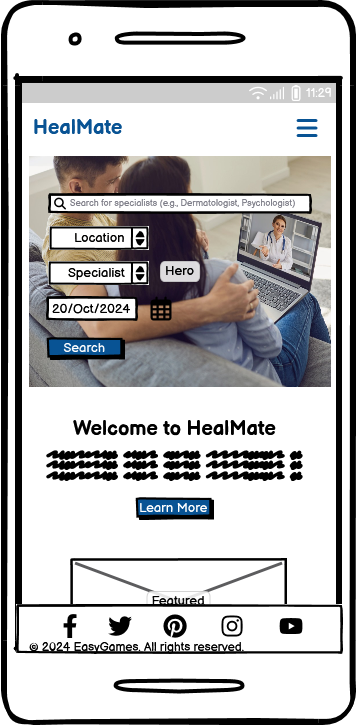
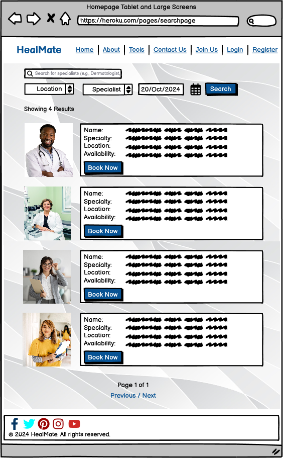
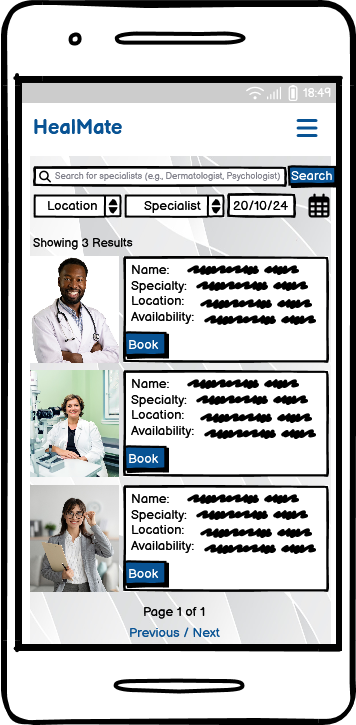
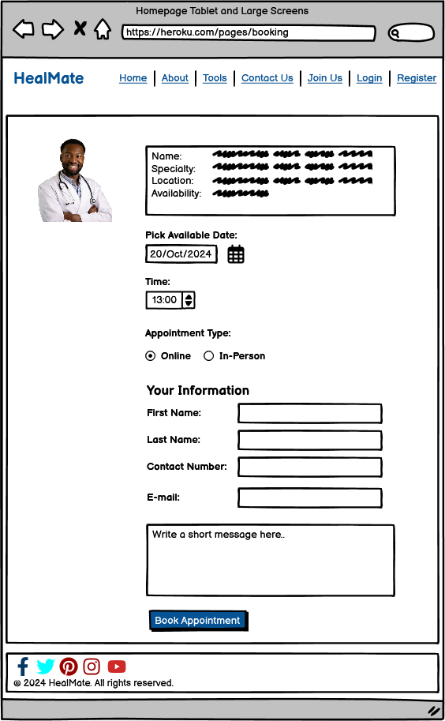
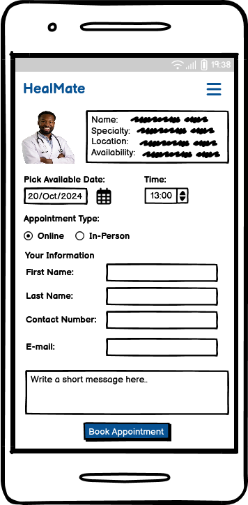
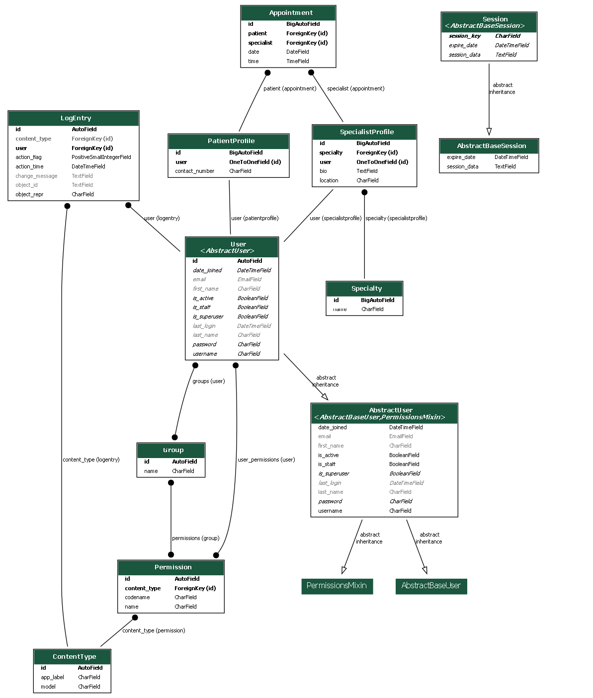

# **HealMate**

**HealMate** is an online platform designed to bridge the gap between patients and medical specialists. It allows users to easily find, book, and consult with professionals from various medical fields such as dermatology, psychology, and optometry. The project is part of the Code Institute's Full-Stack Developer course and focuses on Django framework, database manipulation, and CRUD functionality.

Live site: <a href="https://healmate-378e458234ec.herokuapp.com/" target="_blank">HealMate</a>

For **Admin access** with relevant sign-in information, click <a href="https://healmate-378e458234ec.herokuapp.com/admin/login/?next=/admin/" target="_blank">here</a>.


Github repository, click <a href="https://github.com/easybulb/healmate" target="_blank">here</a>.


## Table of Contents
1. [Introduction](#introduction)
2. [Overview](#overview)
3. [UX - User Experience](#ux---user-experience)
    - [Design Inspiration](#design-inspiration)
    - [Colour Scheme](#colour-scheme)
    - [Font](#font)
4. [Project Planning](#project-planning)
    - [Strategy Plane](#strategy-plane)
    - [Site Goals](#site-goals)
    - [Agile Methodologies - Project Management](#agile-methodologies---project-management)
    - [MoSCoW Prioritization](#moscow-prioritization)
    - [Sprints](#sprints)
    - [User Stories](#user-stories)
5. [Scope Plane](#scope-plane)
6. [Structural Plane](#structural-plane)
7. [Skeleton & Surface Planes](#skeleton--surface-planes)
    - [Wireframes](#wireframes)
8. [Database Schema - Entity Relationship Diagram](#database-schema---entity-relationship-diagram)
9. [Security](#security)
10. [Features](#features)
    - [User View - Registered/Unregistered](#user-view---registeredunregistered)
    - [CRUD Functionality](#crud-functionality)
    - [Feature Showcase](#feature-showcase)
11. [Future Features](#future-features)
12. [Technologies & Languages Used](#technologies--languages-used)
13. [Libraries & Frameworks](#libraries--frameworks)
14. [Tools & Programs](#tools--programs)
15. [Testing](#testing)
  - [Validation Testing](#validation-testing)
  - [User Testing](#user-testing)
  - [Bugs](#bugs)
16. [Deployment](#deployment)
    - [Connecting to GitHub](#connecting-to-github)
    - [Django Project Setup](#django-project-setup)
    - [Cloudinary API](#cloudinary-api)
    - [PostgreSQL](#postgresql)
    - [Heroku deployment](#heroku-deployment)
    - [Clone project](#clone-project)
    - [Fork Project](#fork-project)
17. [Credits](#credits)
    - [Code](#code)
    - [Media](#media)
    - [Additional reading/tutorials/books/blogs](#additional-readingtutorialsbooksblogs)
18. [Acknowledgements](#acknowledgements)

## Overview
HealMate is an online platform that allows users to:
- Register and create a profile
- Search for healthcare specialists by specialty
- Schedule appointments with the desired healthcare provider
- View profiles of registered specialists
- Access a secure dashboard based on user roles (patients, doctors, admins)
- Seamlessly manage medical appointments.

The platform ensures accessibility across all devices and browsers, and its goal is to streamline the process of finding and scheduling medical consultations. In future iterations, HealMate will add functionality for healthcare providers to manage their schedules, send reminders to patients, and offer tools for patient-doctor communication.

## UX - User Experience

### Design Inspiration
My inspiration for HealMate came from a personal experience during a routine visit to my GP. I thought about how many medical consultations, especially those that don’t require physical examinations, could easily be handled online. This thought extended to pregnant women, who often need guidance and reassurance from their midwives or doctors but don’t necessarily need an in-person visit. The convenience of a digital platform for such consultations became clear. The name HealMate reflects the idea of a supportive, reliable partner in managing one's health—much like popular health apps such as ClueMate, where ‘Mate’ signifies companionship and guidance in managing health.

### Colour Scheme
In line with the healthcare theme, I chose a neutral, clean palette:
- **Primary Color:** #6C757D (Muted Blue-Grey)
- **Secondary Color:** #28A745 (Hospital Green)
- **Accent Color:** #17A2B8 (Light Teal)
- **Background:** #FFFFFF (White)
This combination ensures clarity, accessibility, and a professional appearance, allowing for easy navigation throughout the site.

### Font
- For the logo and headers, I will be using **Playfair Display**.
- The rest of the body text and interactive elements will use **Catamaran** for its readability and clean look.

## Project Planning

### Strategy Plane
The primary objective of HealMate is to bridge the gap between patients and healthcare providers. By offering an intuitive interface, users can easily search for medical professionals, book appointments, and receive necessary care without hassle.

### Site Goals
- Provide patients with a user-friendly platform to book appointments with various specialists.
- Allow doctors to manage their appointments and patient information.
- Offer an intuitive interface with role-based dashboards for admins, specialists, and patients.

### Agile Methodologies - Project Management
I used an agile approach to project management. The HealMate development process was broken into sprints, and tasks were added to the GitHub project board to be tracked and managed through issues.

### MoSCoW Prioritization
- **Must-Haves:** User registration and login, specialist search, appointment booking, role-based dashboards.
- **Should-Haves:** Feedback system, health tools, advanced filtering options.
- **Could-Haves:** Profile pictures for users and specialists, messaging system.
- **Won’t-Haves:** Full payment integration, doctor-patient messaging for now.

### Sprints
- **Sprint 1:** Initial Setup - Project, repository, environment setup.
- **Sprint 2:** User Authentication & Role-Based Dashboards.
- **Sprint 3:** Specialist Search & Appointment Booking System.
- **Sprint 4:** Static Pages & UI/UX Improvements.
- **Sprint 5:** Deployment & Testing.

## User Stories
- As a user (patient/specialist/admin), I want to register and log in securely so that I can access my dashboard and manage my activities.
- As a user, I want a personalized dashboard based on my role (patient, doctor, admin) so that I can access the features relevant to me.
- As a visitor, I want to see a well-designed home page that introduces HealMate so that I understand the platform's purpose and value.
- As a patient, I want to search for specialists by category (e.g., Dermatologist, Psychologist) so that I can find a doctor that meets my needs.
- As a patient, I want to view available time slots for a specialist and book an appointment, so that I can get medical advice and treatment.
- As a patient, I want to message my doctor before or after a consultation so that I can ask follow-up questions or clarify doubts.
- As a specialist, I want to manage my schedule and view patient appointments so that I can efficiently conduct consultations.

## Scope Plane
The HealMate platform will include the following MVP functionalities:
- User registration and role-based dashboards.
- Search and filtering system for specialists.
- Appointment scheduling with available specialists.
- Specialist profiles showcasing specialty, experience, and availability.

HealMate ensures user privacy through secure communication and encryption practices, particularly when handling sensitive patient information and specialist consultations. All interactions between users and specialists are secured with SSL/TLS protocols. Additionally, role-based access ensures that sensitive data is only visible to authorized users, maintaining the platform's privacy integrity.

## Structural Plane
The site is structured around an easy-to-use interface. The primary menu includes links to specialist searches, appointment bookings, and user profile management.

## Skeleton & Surface Planes

### Wireframes
Wireframes were created for the following key pages to ensure an intuitive user journey:
- **Home Page**




- **Specialist Search Results**





- **Appointment Booking**





- **User Dashboards** (Patient and Specialist)
- **Admin Panel**

Wireframes were designed using [Balsamiq](https://balsamiq.com/), ensuring responsiveness across devices.

## Database Schema - Entity Relationship Diagram
The ERD for HealMate illustrates the relationships between the users, specialists, appointments, and more. This is essential to demonstrate the relationships between the different models in the PostgreSQL database.

The ERD also demonstrates the platform's role-based structure. Each user is assigned to a specific group (patient, specialist, or admin) that determines their access level. PatientProfile and SpecialistProfile models are linked to the User model, and each profile type has specific fields relevant to their role. Admins have broader access to manage both specialist vetting and platform data.



The above ERD was generated using Python Extension - pygraphviz and pydotplus. Documentation at https://django-extensions.readthedocs.io/en/latest/graph_models.html.

## Security
All data is securely handled with Django’s security features, including:
- CSRF protection for form submissions.
- Data encryption for sensitive information like passwords using Django's built-in authentication.
- Role-based access control to restrict sensitive data to authorized users.

Role-based access control (RBAC) is implemented using Django's Group and Permission systems. Patients, specialists, and admins are grouped based on their role, and their access to features and sensitive information is restricted accordingly. Patients can only access their own medical data and booking history, while specialists can only view data related to their consultations. Admins have the broadest access for system management.

## Features

### User View - Registered/Unregistered
HealMate offers distinct user views. Unregistered users can search for specialists, but registered users have full access to the appointment system and dashboard functionalities.

### User Registration Process
- **Patients:** When a new user registers, they are automatically assigned to the "Patient" group. This ensures that all users begin with patient privileges and access, allowing them to book appointments and view specialist profiles. During the registration process, essential patient profile information is captured (e.g., contact number, address, date of birth, gender). After the registration is complete, a corresponding PatientProfile is automatically created and associated with the user.

- **Specialists:** During the registration process, essential patient profile information is captured (e.g., contact number, address, date of birth, gender). After the registration is complete, a corresponding PatientProfile is automatically created and associated with the user.

- **Admins:** Admin accounts are created manually by other existing admins or superusers within the Django administration area. This ensures that the creation of administrative-level accounts is strictly controlled and follows the platform's internal policies.

This registration flow was chosen to ensure role-based control and security. Patients are the primary users of the platform, and allowing them to register freely makes the service accessible. However, specialists and admins require a higher level of trust and validation, so they undergo a manual vetting process. This ensures that only qualified professionals and authorized admins can manage sensitive tasks such as consultations and platform settings, which helps maintain the integrity and security of the system.

### Role-Based Dashboard Features

**HealMate includes role-based dashboards for different types of users:**
- **Patient Dashboard:** Allows patients to view their profile, manage appointments, and access medical records.

- **Specialist Dashboard:** Specialists can manage their availability, view and approve appointments, and review patient profiles.

- **Admin Dashboard:** Admins can manage users (patients, specialists) and vet specialist applications. They also have access to system-wide settings.

### CRUD Functionality
The following CRUD functionalities are implemented:
- **Users:** Create an account, read profile information, update details, and delete the account.
- **Specialists:** Search and view specialists, book appointments.
- **Appointments:** Create, read, update, and delete appointments.

## Future Features
I plan to implement the following in future iterations:
- Push notifications for upcoming appointments.
- Integrate payment system for paid consultations.

## Technologies & Languages Used
- HTML5 - Markup language for structuring the website
- CSS3 - Styling language for designing the layout and visual aesthetics
- JavaScript - For interactivity and DOM manipulation on the frontend
- Python (Django) - Backend web framework for server-side logic and management
- PostgreSQL - Database management system for storing data
- Cloudinary - Cloud-based image storage solution
- Whitenoise - For serving static files directly from Django

## Libraries & Frameworks
- **Django** - Backend framework
- **Django Crispy Forms** - For elegant form rendering
- **Cloudinary** - Media storage
- **Whitenoise** - For serving static files

## Tools & Programs
- **GitHub Projects** - Project management and tracking
- **Heroku** - Deployment and hosting
- **Balsamiq** - Wireframes and design prototypes

## **Testing**

### **Validation Testing**

All code has been validated through:
- **HTML**: [W3C Markup Validator](https://validator.w3.org/).
- **CSS**: [W3C CSS Validator](https://jigsaw.w3.org/css-validator/).
- **Python**: PEP8 validation to ensure code quality.

*(I will add validation and other tests when site is ready)*

### **User Testing**

- **Browser Compatibility**: The website has been tested on Chrome, Firefox, Safari, and Edge.
- **Responsiveness**: The platform has been tested on mobile, tablet, and desktop devices to ensure optimal performance.
- **Role-Based Dashboard Testing:** Each user type (patient, specialist, admin) was tested to ensure they were directed to the correct dashboard after login. Patients were assigned to the correct group during registration, and specialists were manually added by admins. The redirection logic was thoroughly tested by registering new users and ensuring role-based access was properly applied.
- **Automatic Assignment Testing:** Tests were conducted to verify that newly registered users are automatically assigned to the "Patient" group and that their PatientProfile was successfully created. This was confirmed through both the user interface and the Django admin panel.

### **Bugs**
- ### Bug Fix: `DISABLE_COLLECTSTATIC` Setting Causing Heroku Deployment Failure

**Issue:**  
During the deployment to Heroku, the following error occurred:

The error was caused by the absence of proper static file handling and a misconfiguration in the `INSTALLED_APPS` list in `settings.py`.

**Cause:**  
- The `DISABLE_COLLECTSTATIC=1` config variable was used in Heroku to prevent collectstatic from running during the initial setup.
- There was a duplicate entry for `django.contrib.staticfiles` in `INSTALLED_APPS`, which caused an error when trying to collect static files.

**Steps Taken to Fix:**
1. Fixed the duplicate `django.contrib.staticfiles` entry in `INSTALLED_APPS`.
2. Ensured the static and media handling was properly set up with Cloudinary and Whitenoise.
3. Deleted the `DISABLE_COLLECTSTATIC=1` from Heroku's Config Vars.
4. Deployed again, which successfully collected static files and completed the deployment.


- Bug 2: **To be further filled**.

## Deployment

All code for this project was written in Visual Studio/Gitpod as the integrated development environment. GitHub was used for version control, and the application was deployed to Heroku from GitHub.

### Pre-Deployment

To ensure a successful deployment to Heroku, the following practices are to be followed (Experience from previous Django projects):

- **Requirements File:** The `requirements.txt` file must be kept up to date to ensure all imported Python modules are configured correctly for Heroku.
- **Procfile:** A `Procfile` was added to configure the application as a Gunicorn web app on Heroku.
- **Allowed Hosts:** In `settings.py`, the `ALLOWED_HOSTS` list was configured to include the Heroku app name and `localhost`. Example format:
    ```python
    ALLOWED_HOSTS = ['your-app-name.herokuapp.com', 'localhost']
    ```
- **Environment Variables:** All sensitive data such as the `DATABASE_URL`, `CLOUDINARY_URL`, and `SECRET_KEY` were added to the `.env` file, which is ignored by Git using `.gitignore`. These variables are added to Heroku manually through the Config Vars section.

### Deploying with Heroku

The steps for deploying to Heroku are as follows (Experience from previous Django projects):

1. **Create New App:** Log in to your Heroku account and click on the "Create New App" button.
2. **App Name:** Choose a unique name for your app.
3. **Select Region:** Choose the appropriate region (Europe was selected for this project).
4. **Create App:** Click the "Create App" button to proceed.
5. **Deployment Method:** In the "Deploy" tab, select GitHub as the deployment method.
6. **Connect to GitHub:** Search for the repository name and click "Connect".
7. **Manual or Automatic Deployment:** Select either manual or automatic deployment. Ensure the main branch is selected for deployment.
8. **Config Vars:** In the "Settings" tab, click "Reveal Config Vars" and input the required environment variables.
9. **Buildpack:** Select Node.js and Python as the buildpacks for your project.
10. **Deploy:** Once the configuration is complete, click the "Deploy Branch" button. After successful deployment, a "View" button will appear to take you to the live site.

The live link for this project can be found here: <a href="https://healmate-378e458234ec.herokuapp.com/" target="_blank">HealMate</a>

### Fork this Repository

1. Go to the GitHub repository.
2. Click the "Fork" button in the upper right-hand corner.

### Clone this Repository

1. Go to the GitHub repository.
2. Click the "Code" button at the top of the page.
3. Choose between 'HTTPS', 'SSH', or 'GitHub CLI' depending on your preference.
4. Click the copy button to copy the URL.
5. Open Git Bash.
6. Change the working directory to where you want to clone the directory.
7. Type:
    ```bash
    git clone https://github.com/easybulb/healmate
    ```
8. Press Enter to create the local clone.

**Note:** The difference between a clone and a fork is that with a clone, you need permission to push changes to the original repository, whereas a fork creates an entirely new project under your GitHub account.

## Credits

### Code
- **Django Documentation**: The official docs were invaluable in setting up the project structure and solving specific issues.
- **Django Crispy Forms Documentation**: Used to streamline form rendering.
(more credits to come)

### Media
- Icons and images sourced from **Canva** and **ChatGPT**.
- ERD illustration was generated from **pygraphiz** - A django extension.

### Additional reading/tutorials/books/blogs
- **Django for Beginners** by William S. Vincent.

## Acknowledgements
- A special thanks to.... to complete soon.

